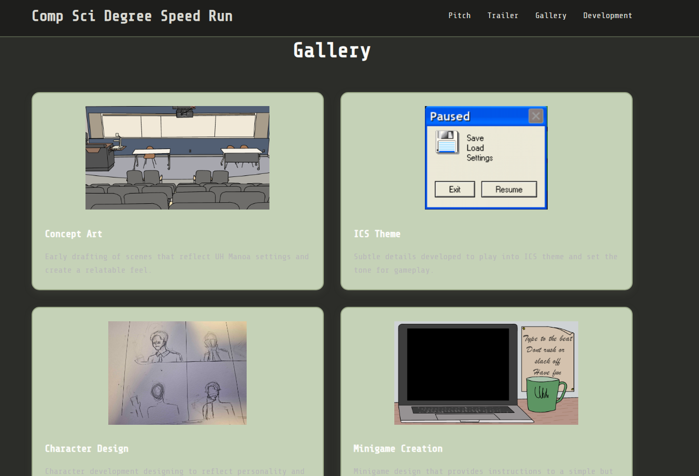

Comp Sci Degree Speed Run is a game I've worked on over the summer to make with my team. While my main focus for that project was the art direction, learning the process through unity was a very instructive experience.

Comp Sci Degree Speed Run was made over the short time span of both of the summer sessions in Unity and coded in C#. It was made to be a visual novel type of game with different key minigames to allow for more interaction in the game as well as it being relatable to the actual process through CS at UHM.

