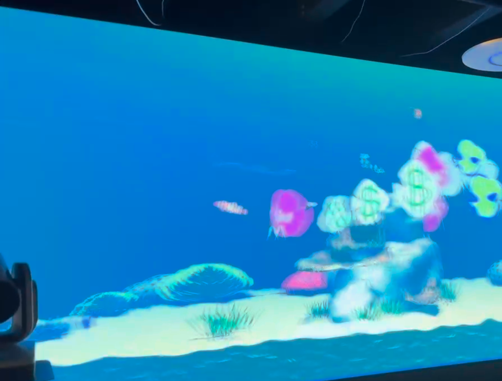

## Overview

During ICS 486, I worked on developing an interactive virtual fishtank application designed for the CyberCANOE—a panoramic immersive visualization environment at the University of Hawaii. This project combined computer graphics, user interaction design, and immersive display technology to create an engaging experience where users could customize swimming fish in real-time.

The CyberCANOE (Cyber-enabled Collaboration, Analysis, Navigation, and Observation Environment) is a large-scale visualization facility that wraps around viewers, creating an immersive 230-degree display. Building applications for this unique environment presented exciting technical and design challenges.

## Project Description

The virtual fishtank allowed users to interact with a simulated underwater environment projected across the CyberCANOE's panoramic wall display. The key innovation was giving users the ability to draw custom textures and patterns directly onto the fish, which would then swim through the virtual ocean environment displaying their new designs.

Users could select fish, apply hand-drawn textures using drawing tools, and watch as their creations swam around the immersive display alongside other fish in the ecosystem. The project created a playful, creative experience that leveraged the CyberCANOE's scale to make users feel surrounded by an underwater world of their own making.

## Technical Implementation

**Environment and Graphics:**
- Built using Unity for 3D rendering and animation
- Implemented realistic fish swimming behaviors and physics
- Created underwater environment with dynamic lighting and particle effects
- Optimized for the CyberCANOE's ultra-wide panoramic display resolution

**User Interaction:**
- Developed texture drawing interface allowing real-time customization
- Implemented texture mapping system to apply user drawings onto 3D fish models
- Created intuitive selection and interaction mechanisms for the large display
- Synchronized user input across the panoramic display system

**Immersive Display:**
- Adapted rendering pipeline for 230-degree field of view
- Managed multi-projector setup and edge blending
- Optimized performance for smooth frame rates across the wide display
- Considered viewer perspective and spatial awareness in design

## My Contributions

I contributed to several aspects of the project:

**Concept Development and Scripting:** I helped conceptualize and develop the foundational scripts that drove the project's core functionality. This included figuring out the architecture behind how the fishtank ecosystem would work, how fish would behave and interact with textures, and how user input would translate into visual changes. Working through the conceptual challenges of the scripting system was crucial to making the rest of the project possible.

**3D Modeling:** I created 3D models to enhance and improve the visual quality of the scene. This included developing assets for the underwater environment, fish models, and decorative elements that made the fishtank feel more immersive and polished. The models were optimized for real-time rendering on the CyberCANOE's display system.

**Graphics Programming:** Implemented the fish rendering system and texture mapping pipeline that allowed user-drawn patterns to be dynamically applied to 3D models while maintaining proper UV mapping and visual quality.

**Interaction Design:** Designed and developed the user interface for drawing textures, considering the unique challenges of interaction in a large-scale immersive environment where traditional UI paradigms don't always apply.

**CyberCANOE Integration:** Adapted the application to work effectively with the CyberCANOE's panoramic display, ensuring the experience took advantage of the immersive environment rather than simply being stretched across it.

## What I Learned

**Immersive Display Technology:** Working with the CyberCANOE taught me about the unique considerations of large-scale immersive visualization—from technical aspects like multi-projector calibration to design considerations like how people naturally look and move in these spaces.

**Real-Time Graphics:** Implementing the texture mapping and rendering systems deepened my understanding of computer graphics pipelines, shaders, UV mapping, and performance optimization for interactive applications.

**User Experience in Immersive Spaces:** I learned that designing for immersive environments requires rethinking traditional UI/UX principles. What works on a monitor or even VR headset doesn't necessarily translate to a room-scale panoramic display.

**Creative Coding:** This project reinforced how code can be a medium for creative expression. Building tools that let users create and interact artistically required balancing technical constraints with creative freedom.

**Collaborative Development:** Working on a project for specialized hardware like the CyberCANOE required close collaboration with the facility staff and careful testing in the actual environment, teaching me valuable lessons about real-world deployment.

## Impact

The virtual fishtank project demonstrated how interactive media can transform specialized visualization facilities like the CyberCANOE into accessible, playful spaces. By letting users personalize the fish swimming around them, we created an experience that was both technically impressive and emotionally engaging—viewers became co-creators of the immersive environment they were experiencing.

This project exemplified the intersection of art and technology, showing how computer science skills can enable new forms of creative expression and human-computer interaction in immersive spaces.

## Technology Stack

- **Engine:** Unity
- **Languages:** C#
- **Graphics:** Custom shaders, real-time texture mapping
- **Hardware:** CyberCANOE panoramic display system
- **Tools:** Unity Editor, Visual Studio

---

*This project was developed as part of ICS 486 at the University of Hawaii, utilizing the Laboratory for Advanced Visualization and Applications (LAVA) CyberCANOE facility.*
